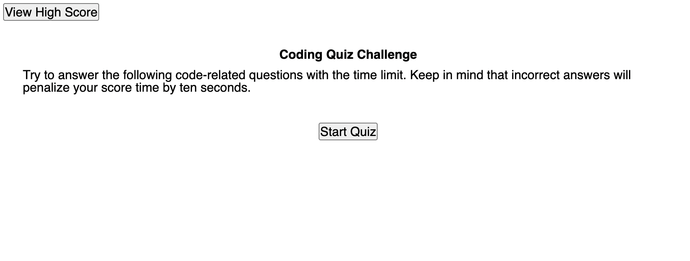
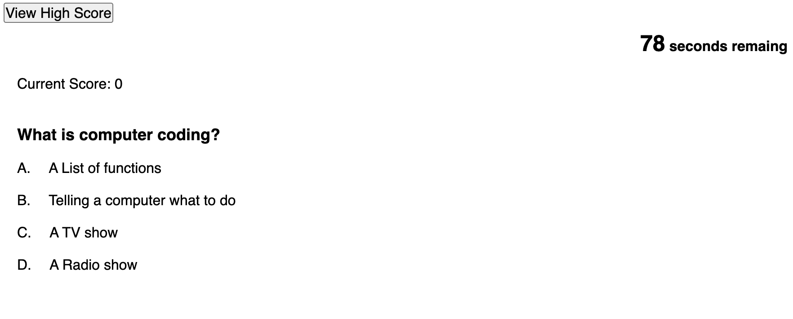

# Code-Quiz
Multiple choose quiz on fundamental coding knowledge

## Description

This project is to build a interactive coding knowledge quiz web page by using javascript, CSS and HTML.

## Installation

N/A

## Usage

visit application URL: https://benliu104.github.io/Code-Quiz/

Step 1: Click on "Start Quiz" button to start.

Step 2: Click/Tap on the answer you want to choose. Then it will jump to next question.
(Wrong answer will penalize time by 10 seconds. Correct answer will get 10 scores)

Step 3: After finish all 10 questions, you will get your final result. You may enter your name to record it.

Step 4: All score record will show for reference. Click "Back" to start the quiz again or Click "Clear" to clean all score record.

## Credits

Ben Liu: https://github.com/BenLiu104

## License

Please refer to the LICENSE in the repo.